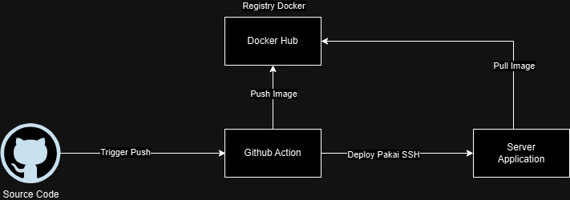
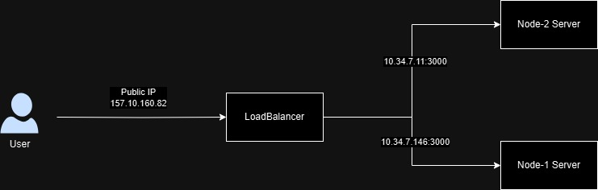

# DevOps Engineer - Technical Test

Dokumentasi Jawaban dari soal teknikal devops

---

## Objective

Ada beberapa point yang harus diselaikan
1. CICD Aplikasi Nodejs
2. Infrastruktur Server menggunakan Loadbalancer

---
## Desclaimer

Ada Beberapa Kendala yang belum sempat saya selesaikan dalam test ini
* Tidak bisa Menjalankan NPM Test baik dilocal maupun di cicd
* Belum menerapkan IAC karna cloud (idcloudhost) yang digunakan belum disupport oleh terraform (IAC)

---

## Requirements

* Cloud Server (Idcloudhost)
* Docker
* SSH
* HAProxy
* Git


### CI Build Pipeline

<div align="center">
      
</div>

Proses CICD dipicu saat ada push kedalam branch main (dalam kasus lain bisa berbeda sesuai dengan env yang dituju) dan akan melakukan beberapa proses sebegai berikut :

1. Login dan Build Image untuk service node 
2. Push Image Kedalam Docker Registry
3. SSH kedalam server tujuan dan menjalankan file bash yang akan mengeksekusi beberapa command :
    
    a. Menghapus Semua Container yang berjalan
    b. Menghapus Semua image
    c. Mengunduh image terbaru
    d. Menjalankan image yang berhasil diunduh 

4. Jika ingin melihat history CICD bisa mengunjungi link berikut https://github.com/ayiangio/ntx-devops-test/actions 

---
### Target Environment

<div align="center">
      
</div>

Arsitektur Infrastruktur dibagun menggunakan 2 Server server HAPROXY dan Server Node

1. Server HAproxy menggunakan algoritma round-robin.
2. Request dari public akan diteruskan ke salah satu node-server sesuai dengan beban trafic yang diterima
3. dengan menggunakan configurasi HAProxy sebagai berikut :
```
frontend node_frontend
    bind *:80
    default_backend node_backend

backend node_backend
    balance roundrobin
    option httpchk GET /
    server node1 10.34.7.146:3000 check
    server node2 10.34.7.11:3000 check

#Stats
listen stats
    bind *:8404
    stats enable
    stats uri /stats
    stats realm Haproxy\ Statistics
    stats auth admin:password
```
    a. Pada bagian node_frontend menerima dan meneruskan request dari Public, jika tidak didefine maka request dari public tidak akan masuk kedalam server
    b. pada bagian node_backend adalah config untuk menentukan alogoritma LB yang akan dipakai dan server tujuan 
    c. (optional) config untuk menexpose monitoring HAProxy  
4. Untuk mengujinya bisa mengunjungi Link berikut http://157.10.160.82/ dan untuk melihat status dari HAProxy bisa mengunjungi link berikut http://157.10.160.82:8404/stats

---

## Terima kasih 